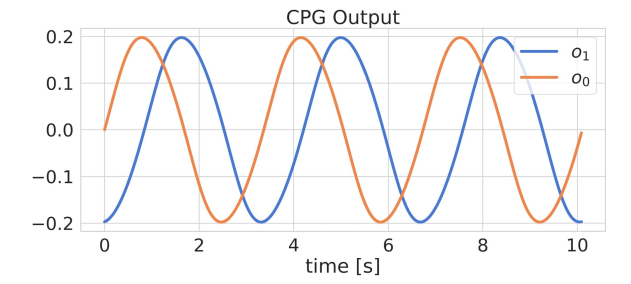
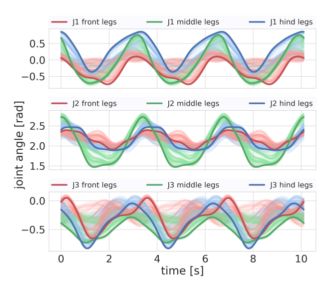
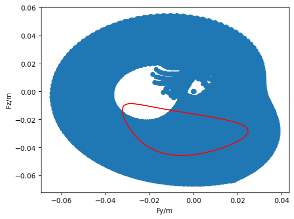
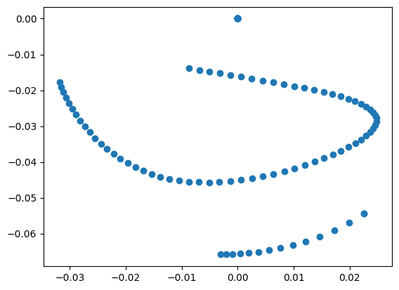
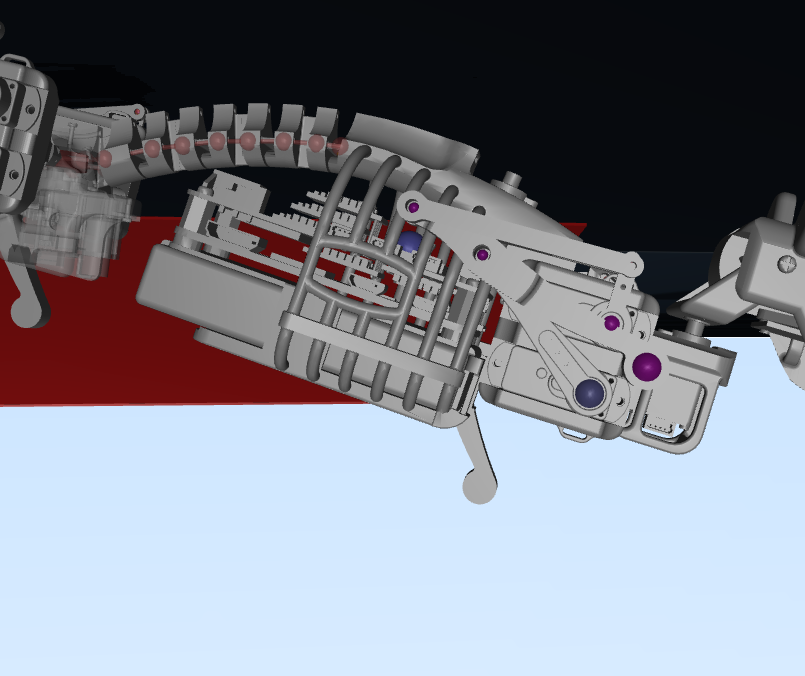
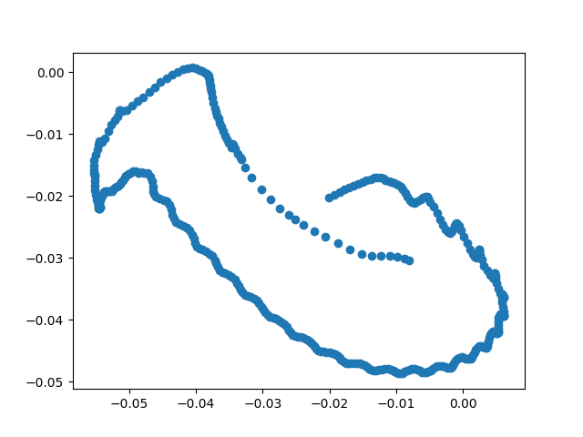
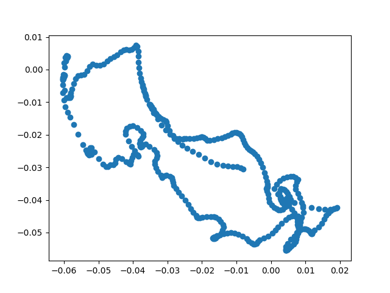
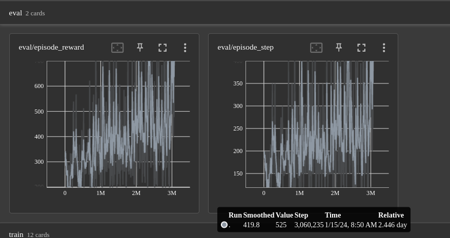

# 任务汇报1
## cpg-rbf 的理解
cpg原来是指在动物的脊髓中有一组相互连接的神经元，其可以在不依赖感知反馈的条件下主动激活区生成特定的运动模式,后续人们以此为灵感去设计动物机器人的运动模式

在机器人领域一种比较典型的cpg架构为:SO2-oscillator-based cpg,其输出信号的形式为:

即两个随时间变化的正弦信号:
$$
 o(t)=A sin(\omega t+B)
$$
这两个正弦信号是分别施加在两个joint上的，这样在随着时间变化过程中其足末的相对运动轨迹就会呈现出椭圆形，通过改变幅度A,频率$\omega$,和偏置B就可以改变最终生成的椭圆足部轨迹的形状，但单纯的cpg架构其足部轨迹改变并不灵活有一定的局限性，所以又引入了rbf网络架构作为一种函数近似，它会对谐波信号进行局部的放缩，偏移等操作，使其产生的足部轨迹更加灵活，选用rbf网络架构更多是其参数更少，更便于解释，经过rbf模块编码后的cpg输出结果如下图所示:

## ETG暂态判断公式整理
1. 小鼠是否卡在原地不动判断
    >这里采用的是小鼠单足运动在x,y,z方向的标准差之和作为一个暂态判断标准，即每走100timestep记录小鼠足末空间(**世界坐标系下**)位置(x,y,z),这里维护一个数组维护10组小鼠足末空间位置，每新走100步，新的足末空间位置加入数组，最旧的足末空间位置移出数组，并计算x,y,z三个方向分别的标准差，如果小鼠卡在一个地方就意味着小鼠在世界坐标系下足末变化空间不大，x,y,z方向足末位置变化不大，在数学上反映就是其标准差小，将三个方向的标准差进行加和和某个阈值(**根据实验设定**)进行比较，如果小于该阈值就基本说明小鼠卡住了 
    >
    >这里之所以没有直接判断足末端点经过一个时间段后是否其空间位置基本不发生变化是因为遗传算法是参数空间进行搜索的训练，小鼠可能会有各种各样的足末轨迹形态，它很可能会卡bug出现就是在经过某个特定时间段前后小鼠足末位置之差超过某个阈值但就是停滞不前，采用标准差可以很好解决这一问题
2. 小鼠沿x方向移动过远判断
    >x方向是小鼠横向移动的方向,y轴是小鼠前进的方向，小鼠经常会在刚上坡时由于上不去坡而卡住，如果坡的宽度比较短的话小鼠经常会出现一边卡着不前进一边往x方向不断移动导致**越过斜坡**的假象，最终就会变成一个"**假阳性**"成功目标，导致随后的遗传算法训练都往这方面去靠.而如果把坡的宽度设置无限大，往往小鼠可能会一直卡在那里一边往x方向偏移，浪费训练时间。所以增加了一个判断评判小鼠足末x方向是否偏移超过某一阈值
3. 小鼠沿反方向运动
   >小鼠可能一开始就直接朝相反运动方向运动，故增加一个小鼠是否向反方向运动过远的判断来减少可能卡bug的情况

上述3点整体上都是为了消除"假阳性目标",缩短训练时间以尽快搜索得到正确的轨迹

## ETG-RL训练阶段小鼠机器人与四足机器狗周期信号对比
|                                      | 小鼠机器人                                                 | 四足机器狗                      |
| ------------------------------------ | ---------------------------------------------------------- | ------------------------------- |
| timestep                             | 0.005s(再大小鼠不能正常运动)                               | 0.026s                          |
| 周期T                                | 2s                                                         | 0.5s                            |
| RL-Steps(多少步产生一组强化学习反馈) | 20(ETG controller控制下走的20timestep共享一个强化学习反馈) | 1(每个timestep都有强化学习反馈) |
| RL等效timestep                       | 20*0.005=0.1s                                              | 0.026s                          |

## ETG-RL reward公式整理
$v_0$:小鼠body实际运动速度

$v_1$:小鼠foot平均运动速度(对四足都计算最后取平均)

d:小鼠实际运动朝向，以xyz欧拉角的形式表示

$d_{target}$:预先设定好的小鼠运动方向，即小鼠理想运动方向,xyz欧拉角形式表示

$v_{foot}$:小鼠foot理想达到的平均运动速度，这里的理想状态是参考已经训练成功的ETG架构下小鼠在正常运动状态下foot的平均运动速度，**这里ETG更多是作为微调保证小鼠任何环境下运动速度都尽可能不变**

$v_{body}$:小鼠body理想达到的运动速度，这里的“**理想**”也是参考成功的ETG架构

k:reward增益因子，以尽可能让小鼠的reward反馈在数量级上和参考论文实验结果相一致

f:reward映射，数学形式为:
$$
f(v)=1-tanh((w*(min(v,t)-t))^2)
$$
这里t代指v理想达到的数值，w是个调节因子，用于决定当v偏离t一定程度时其受到的惩罚力度有多大

最终整个奖励函数数学形式为:
$$
Reward=(f(v_0)+f(v_1))*f(d)*k
$$
鼓励小鼠尽可能以理想的foot和body速度并按照给定方向进行运动

## 小鼠足部运动分析
对小鼠足部运动可达范围和ETG架构理论运动范围进行可视化得到下图结果

蓝色区域是理论上小鼠足部末端可以达到的位置，红色线是ETG架构的理论运动轨迹，可以看到红色线有部分实际位于运动死区，但是这部分区域在进行逆向运动学解算时是合法的，其实际的理论运动范围为:

通过与仿真结果的分析得到在运动死区部分的轨迹点实际上绝大部分都位于(0,0)(actuator angle)上作为支撑相而存在，这样看来是否要将其足末相对位置约束在可达范围之内并没有那么重要(**当然也是可以探究的点**)

下图是一张小鼠运动死区实例

通过对小鼠的死区运动分析和ETG-rl实际运动的观察，个人认为小鼠实际想要到达运动死区并不是一件容易的事，相反小鼠目前训练出现的问题更多是它的运动过于震荡了，按理说在平地上它不应该过于影响ETG架构，但实际上在平地上其对ETG架构影响很大，而在上坡处奖励节点过于稀疏导致其总是上不去坡，一直处于震荡状态，这是我个人思考应该要着力解决的点，当前实验过将小鼠与地形的接触状态加入到observation空间中以期望其学到(0,pi,pi,0)的平稳架构，但就实际实验结果来看效果并不好

下面几张图是对小鼠实际运动的分析

  

    
    
ETG_real

  

  

    
    
ETG_rl_real

  

  

    
ETG_RL_TrainAnalysis

